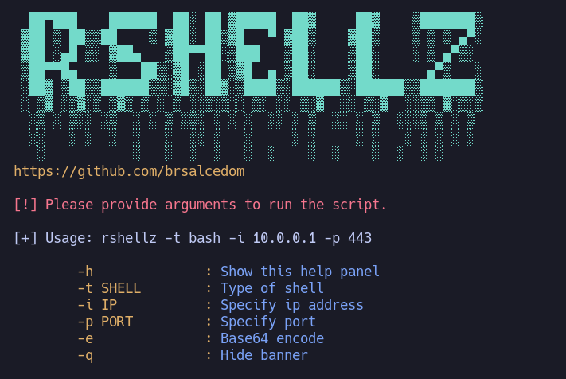

<p align="center">
    
</p>

<div align="center">

<a href="https://github.com/Brsalcedom/rshellz/blob/main/LICENSE">

</div>

---

## Requirements

`xclip` installed.


## Installation

```
sudo curl -s https://raw.githubusercontent.com/Brsalcedom/rshellz/main/rshellz -o /usr/bin/rshellz; sudo chmod +x /usr/bin/rshellz
```

## Usage

The basic usage requires a shell type `-t`, local ip address `-i` and local port `-p`.


  
### Options

```
	-h		: Show this help panel
	-t SHELL	: Type of shell: [bash, python, perl, php, netcat, ruby, java]
	-i IP		: Specify ip address
	-p PORT		: Specify port
	-e		: Base64 encode
	-q		: Hide banner
```
### Shells  

The following shell types are supported.
- bash
- perl
- php
- python
- ruby
- netcat
- java
- xterm

Example: `rshellz -t bash -i 10.0.0.1 -p 443`.


### Encoding
  
You can use `-e` to **base64** encode the payload.


  
