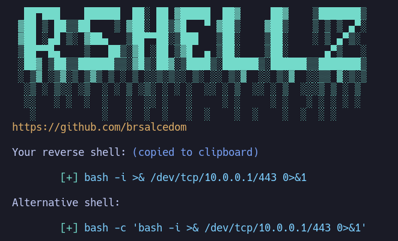
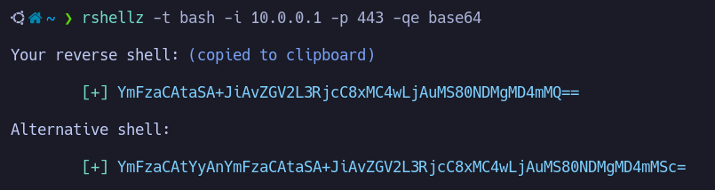
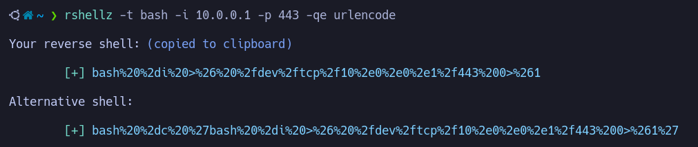

<p align="center">
    
</p>

<div align="center">

<a href="https://github.com/Brsalcedom/rshellz/blob/main/LICENSE">

</div>

---

## Requirements

`xclip` installed.


## Installation

```
sudo curl -s https://raw.githubusercontent.com/Brsalcedom/rshellz/main/rshellz -o /usr/bin/rshellz; sudo chmod +x /usr/bin/rshellz
```

## Usage

The basic usage requires a shell type `-t`, local ip address `-i` and local port `-p`.

Example: `rshellz -t bash -i 10.0.0.1 -p 443`.


  
### Options

```
-h		: Show the help panel
-t SHELL	: Type of shell
-i IP		: Local ip address
-p PORT		: Local port
-e ENCODING	: Encode to base64 / urlencode
-q		: Hide banner
```
### Shells  

The following shell types are supported.

- bash
- perl
- php
- python
- ruby
- netcat
- java
- xterm

### Encoding

There are two encoding formats available at the moment.

- base64
- urlencode

You can use `-e` flag to specify the encoding.




  
